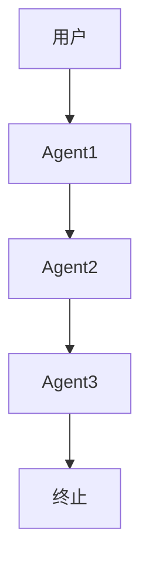
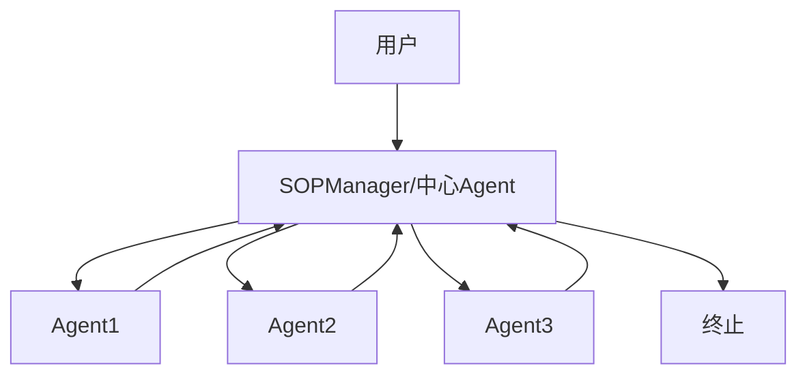
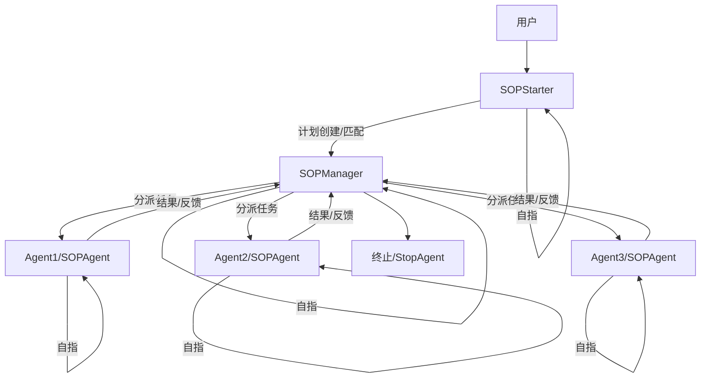
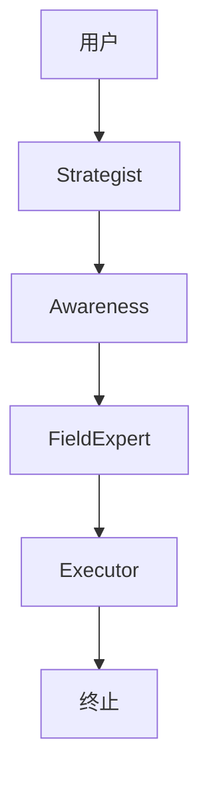
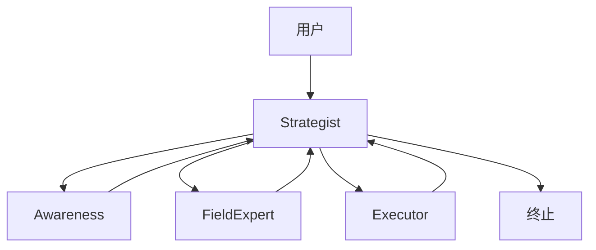
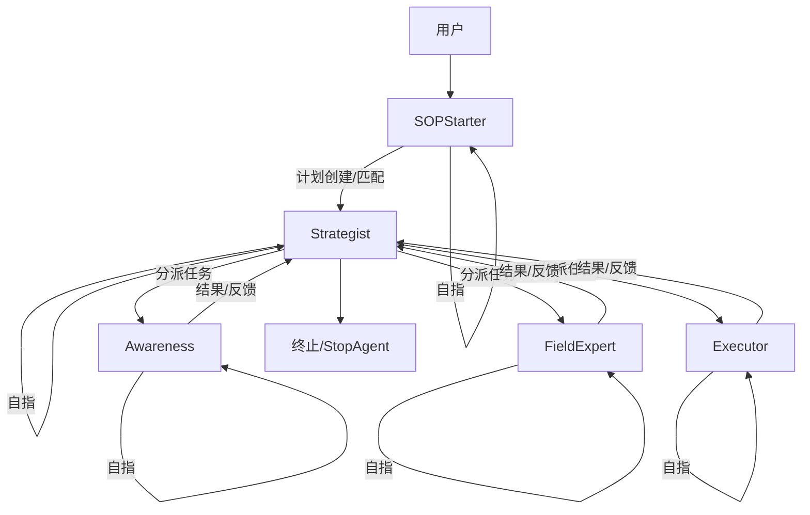

# SAFE SOP 多智能体系统实现原理与工作流（新版）

## 1. 引言

本文档阐述 SAFE (Simulation and Agent Framework for Emergencies) 框架中，基于标准化操作规程 (SOP) 的多智能体团队的最新实现原理和工作流程。新版架构统一了执行者智能体（SOPAgent），引入了 QuickThink 机制，并将原 NexusAgent 更名为 SOPManager，使系统结构更简洁、职责更清晰、扩展性更强。

> **本设计为通用多智能体系统架构，强调配置驱动、结构化消息、可自指与多轮推理，不依赖于具体的多智能体开发框架（如 autogen），可适配多种实现。**

## 2.x 三种典型多智能体流程图对比（Mermaid 可视化）

### 1. 单向无环图（DAG）

**特点说明：**
- 结构简单，消息单向流动，流程不可回溯。
- 每个 Agent 只处理一次任务，无法多轮推理或自我修正。
- 适合线性审批、一次性任务分派。
- 不适合复杂任务分解和多步工具链调用。

---

### 2. 中心有环图（Hub-and-Spoke with Central Loop）

**特点说明：**
- 以中心 Agent 为核心，所有任务流转都需经过中心节点。
- 中心节点可多轮处理，便于全局控制。
- 执行 Agent 只能单轮处理，复杂任务需中心节点反复分派，效率低。
- 适合传统调度、中心化审批。
- 不适合执行 Agent 多轮自适应处理。

---

### 3. 自指有环图（Self-looping Agents, Fully Cyclic）

**特点说明：**
- 每个 Agent（包括 SOPManager、SOPAgent、SOPStarter）都自动拥有自指 Edge，可多轮自我处理。
- 支持多轮 LLM/工具链调用，Agent 可自我分解、反复思考，直至任务完成。
- 流程灵活，支持复杂任务、动态决策和自适应推进。
- 终止条件灵活，便于扩展并发、协作、嵌套等高级特性。
- 是复杂 SOP 流程的最佳架构。

---

## 2.x.1 三种结构的详细对比与选择理由

- **单向无环图**：实现简单，但无法满足多轮推理和复杂任务分解需求。
- **中心有环图**：中心节点可多轮处理，但执行 Agent 仍然只能单轮，流程效率低，耦合度高。
- **自指有环图**：每个 Agent 均可多轮自适应处理，支持复杂 SOP 流程、动态任务分解和灵活终止，是最具扩展性和智能性的方案。
- **测试用例验证**：`test_graph_flow.py`、`test_sop_flow.py` 均证明只有自指有环图能满足复杂业务需求。

---

## 2.x.2 通用多智能体系统的技术架构抽象（以 autogen 为例，通用化描述）

### 1. Agent（智能体）
- **定义**：具备独立决策、任务处理、工具调用能力的实体。
- **实现思路**：每个 Agent 通过 on_messages_stream 等异步方法处理消息，可注册多种工具（如计划管理、资产管理、任务判断等）。
- **自指能力**：Agent 可根据任务状态决定是否自指（即继续处理），实现多轮推理和自适应任务推进。

### 2. 工具（Tool/Plugin）
- **定义**：Agent 可调用的外部能力模块，如计划管理、信息检索、资产管理等。
- **实现思路**：工具以函数/类形式注册到 Agent，Agent 可在 LLM 推理或业务逻辑中动态调用。
- **通用性**：工具接口标准化，便于跨 Agent、跨平台复用。

### 3. 流程图（GraphFlow/Workflow Engine）
- **定义**：描述 Agent 之间消息流转和任务推进的有向图结构。
- **实现思路**：通过配置文件或代码自动生成节点（Agent）和边（消息流转规则），支持自指 Edge、条件分支、终止节点等。
- **自指 Edge 自动生成**：流程图构建时为每个 Agent 自动添加自指 Edge，除非显式禁止。

### 4. 配置驱动（Config-driven）
- **定义**：所有 Agent、工具、流程图结构、团队分工等均由配置文件（如 yaml/toml）驱动。
- **实现思路**：核心代码只负责解释和调度，业务变更只需改配置，支持多团队、多模板、灵活扩展。

### 5. 结构化消息与上下文管理
- **定义**：Agent 之间消息采用结构化格式（如 pydantic model/schema），上下文对象统一管理流程状态、轮数、日志等。
- **实现思路**：消息标准化，便于 LLM 解析和多 Agent 协作；上下文对象贯穿全流程，支持追踪、调试和异常处理。

### 6. 终止判定与保护机制
- **定义**：流程终止条件结构化，所有自指 Agent 均有最大轮数保护，防止死循环。
- **实现思路**：终止信号标准化（如 ALL_TASKS_DONE），异常情况有兜底处理，便于流程健壮运行。

### 7. 技术架构设计
- **配置驱动**：所有角色、流程、工具、SOP步骤均通过配置文件（如config.yaml）定义，支持灵活扩展和快速适配。
- **资产中心（Asset Hub）**：所有关键产出（如态势报告、风险评估、行动方案等）以结构化资产形式集中管理，支持版本控制、引用和追溯。
- **结构化消息**：Agent间通信采用标准化schema（如pydantic model），消息内容可直接引用资产库中的唯一标识，提升一致性和可解析性。
- **行为树/状态机**：每个Agent的决策逻辑采用行为树或有限状态机建模，结合异步消息流，实现动态行为选择和流程推进。
- **自指与多轮推理**：流程图（GraphFlow）自动为每个Agent生成自指Edge，支持多轮推理、工具链调用和自适应任务分解。
- **分层解耦**：Starter/Manager/Agent/StopAgent分工明确，解耦任务匹配、计划推进、任务执行和终止判定。
- **可扩展性与可迁移性**：架构支持多团队、多模板、异构Agent，便于迁移到工业、医疗、项目管理等其他领域。

### 8. 系统架构设计
- **分层结构**：
  - 输入层（用户/外部系统）：提供任务或事件输入。
  - 启动层（SOPStarter）：负责任务与workflow匹配、计划创建。
  - 协调层（SOPManager）：负责流程推进、任务分派、终止判定。
  - 执行层（SOPAgent/SAFE四大角色）：负责具体任务执行、工具调用、多轮推理。
  - 终止层（StopAgent）：输出终止信号，支持后续日志、通知等扩展。
- **流程图驱动**：系统通过GraphFlow/DiGraphBuilder自动生成Agent节点和消息流转边，支持自指、条件分支、终止节点。
- **资产库与消息总线**：所有结构化产出集中存储于资产库，Agent间通过结构化消息和资产引用协作。
- **上下文与状态管理**：统一上下文对象管理流程状态、轮数、日志，支持追踪、调试和异常处理。

### 9. 软件实现思路
- **配置解析**：系统启动时加载config.yaml等配置文件，动态生成团队、角色、SOP流程和工具注册。
- **流程图构建**：根据SOP配置自动构建GraphFlow，所有Agent自动添加自指Edge，支持灵活路由和分支。
- **Agent实现**：每个Agent实现on_messages_stream等异步消息处理方法，结合行为树/状态机决策，注册所需工具。
- **资产管理**：实现统一的资产库模块，支持结构化数据的存储、检索、版本管理和引用。
- **消息与上下文**：定义标准化消息schema，所有消息流转和上下文状态变更均结构化管理。
- **终止与保护机制**：SOPManager/StopAgent负责终止判定，所有自指Agent有最大轮数保护，防止死循环。
- **测试与验证**：通过test_graph_flow.py、test_sop_flow.py等用例，验证多轮推理、结构化消息流转和终止判定的正确性。
- **人机协同接口**：为人工确认、干预和监控预留接口，支持人类指挥官参与决策。

### 10. 实现思路总结
- **分层结构**：
  - 输入层（用户/外部系统）：提供任务或事件输入。
  - 启动层（SOPStarter）：负责任务与workflow匹配、计划创建。
  - 协调层（SOPManager）：负责流程推进、任务分派、终止判定。
  - 执行层（SOPAgent/SAFE四大角色）：负责具体任务执行、工具调用、多轮推理。
  - 终止层（StopAgent）：输出终止信号，支持后续日志、通知等扩展。
- **流程图驱动**：系统通过GraphFlow/DiGraphBuilder自动生成Agent节点和消息流转边，支持自指、条件分支、终止节点。
- **资产库与消息总线**：所有结构化产出集中存储于资产库，Agent间通过结构化消息和资产引用协作。
- **上下文与状态管理**：统一上下文对象管理流程状态、轮数、日志，支持追踪、调试和异常处理。

## 2.x.3 实现思路总结

- **核心思想**：每个 Agent 都是可多轮推理、可自指的智能体，流程图自动生成自指 Edge，所有行为和分工均由配置驱动，消息结构化、上下文统一管理。
- **作用**：支持复杂 SOP 流程、动态任务分解、多步工具链调用和灵活终止，便于大规模多智能体系统的开发和维护。
- **通用性**：该架构不依赖于具体框架（如 autogen），可适配多种多智能体平台和业务场景。

---

## 2.x.4 SAFE 团队（safe-sop）配置实例流程图对比

### 1. 单向无环图（DAG）——SAFE 团队示例

**说明：**
- 用户输入任务，依次由 Strategist（战略）、Awareness（态势）、FieldExpert（专家）、Executor（执行）单轮处理。
- 每个角色只处理一次，无法多轮推理或自我修正。
- 不适合 SAFE 团队 SOP 的复杂多步任务。

---

### 2. 中心有环图（Hub-and-Spoke with Central Loop）——SAFE 团队示例

**说明：**
- Strategist 作为中心节点，负责调度和多轮决策。
- 其他角色只能单轮处理，复杂任务需 Strategist 反复分派。
- 适合传统调度，但不支持角色自身多轮自适应处理。

---

### 3. 自指有环图（Self-looping Agents, Fully Cyclic）——SAFE 团队示例

**说明：**
- SAFE 团队所有角色（Strategist、Awareness、FieldExpert、Executor）都可多轮自指处理任务。
- SOPStarter 负责任务与 workflow 匹配和计划创建。
- Strategist 负责计划推进、任务分派和终止判定。
- 各角色可根据任务复杂度多轮推理、工具调用和自我分解，直至任务完成。
- 完全贴合 SAFE 团队 SOP 的复杂多步协作需求。

---

## 3. 设计要点与最佳实践

### 3.1 自指 Edge 自动生成
- 在流程图（GraphFlow/DiGraphBuilder）构建阶段，自动为每个 Agent 节点添加自指 Edge（A→A），除非明确禁止。
- 可通过 Agent 元数据（如 `allow_self_loop=True`）灵活控制。
- Agent 在 on_messages_stream 逻辑中，判断任务是否完成，未完成则通过自指 Edge 继续处理。

### 3.2 SOPStarter 分工
- 引入 SOPStarter 作为独立 Agent，专注于"用户输入任务与 workflow 匹配、计划创建"。
- SOPStarter 输出结构化计划信息，交由 SOPManager 负责后续计划推进与任务分派。
- SOPManager 专注于计划管理、任务推进、终止判定。

### 3.3 终止判定与 StopAgent
- SOPManager 在所有任务完成时输出结构化终止信号（如 `ALL_TASKS_DONE`）。
- 可选 StopAgent 作为流程终点，便于后续扩展日志、通知等终止处理。

### 3.4 结构化消息与上下文
- Agent 之间的消息采用结构化格式（如 pydantic model/schema），减少 LLM 解析歧义。
- 上下文对象统一管理流程状态、轮数、日志等，便于追踪和调试。

### 3.5 最大轮数保护与异常处理
- 所有自指 Agent 均需最大轮数保护，防止死循环。
- 终止条件需明确，异常情况需有兜底处理。

### 3.6 配置驱动与可扩展性
- 团队定义、Agent 配置、SOP 工作流模板、流程图路由等均由配置文件驱动。
- 支持多模板、多团队、灵活角色分工，便于业务快速适配和扩展。

## 4. 典型流程与测试用例验证

### 4.1 流程示意图

```
用户
  │
  ▼
SOPStarter（任务匹配/计划创建）
  │
  ▼
SOPManager（流程协调/计划推进/任务分派）
  │
  ├───► SOPAgent（任务执行/QuickThink/自我分解/自指）
  │
  └───► StopAgent（流程终点，可选）
```

### 4.2 测试用例对比
- `test_graph_flow.py`：验证了自指有环图下，Agent 能多轮处理任务，直至满足终止条件。
- `test_sop_flow.py`：集成测试了 SOPStarter→SOPManager→SOPAgent→StopAgent 的完整流程，验证了结构化消息流转和多轮自指能力。
- 通过对比不同流程图结构，证明自指有环图是唯一能满足复杂 SOP 流程需求的方案。

## 5. 结论与展望

- **自指有环图**是复杂多智能体 SOP 系统的最佳架构，支持多轮推理、工具链调用、动态任务分解和灵活终止。
- 该设计为通用多智能体系统架构，强调配置驱动、结构化消息、上下文管理和可扩展性。
- 后续可在此基础上扩展并发、协作、嵌套等高级智能体协作能力。

## 6. 参考与补充

- 相关测试用例：`tests/workflows/test_graph_flow.py`, `tests/workflows/test_sop_flow.py`
- 典型配置文件：`teams/safe-sop/config.yaml`
- 设计与实现建议详见本文件前述章节。

## 3.x 理论到实现的落地路径（基于SAFE理论设计的多智能体SOP系统）

### 3.x.1 角色分工与功能映射
- SAFE 框架提出的四大核心角色（Strategist, Awareness, Field Expert, Executor）可直接映射为多智能体系统中的异构 Agent，每个 Agent 通过配置文件（如 config.yaml）定义其职责、能力和工具集。
- 角色分工通过配置驱动，便于灵活扩展和适配不同应急场景。例如，Field Expert 可根据事件类型动态加载不同领域的专家 Agent。
- 每个 Agent 的核心能力（如信息整合、风险评估、方案生成、执行验证）通过注册工具和行为逻辑实现，支持多轮推理和自适应任务处理。

### 3.x.2 流程驱动与结构化协作
- SAFE 理论强调流程驱动和标准化协作，落地时可通过 SOP 配置文件自动生成流程图（GraphFlow），每个节点为 Agent，每条边为消息流转规则。
- SOP 步骤（如态势理解、目标设定、方案制定等）转化为 Agent 间的任务分解和消息传递，流程图支持自指 Edge，保证多轮推理和复杂任务分解能力。
- 任务流转采用结构化消息，所有关键产出（如报告、方案、评估结果）均以标准化资产形式存储和引用。

### 3.x.3 信息资产中心与消息结构化
- 理论中的"资产中心"在实现中对应为统一的信息资产库（Asset Hub），所有 Agent 产出的结构化信息（如态势报告、风险评估、行动方案等）均存储于此。
- Agent 间消息采用结构化 schema（如 pydantic model），消息内容引用资产库中的唯一标识，提升信息一致性、可追溯性和复用性。
- 资产库可支持版本管理、权限控制和多 Agent 并发访问，便于后续扩展。

### 3.x.4 行为树/状态机思想在 Agent 决策中的落地
- 每个 Agent 的决策逻辑可用行为树（Behavior Tree）或有限状态机（FSM）建模，结合 on_messages_stream 等异步处理机制，实现基于当前状态和输入的动态行为选择。
- 例如 Strategist Agent 会根据当前 SOP 步骤、资产状态和消息内容，动态选择分派任务、整合信息、推进流程或终止。
- 这种建模方式便于流程可视化、调试和扩展。

### 3.x.5 SOPStarter/SOPManager/SOPAgent/StopAgent 的分工与协作
- SOPStarter 负责用户输入与 workflow 匹配、计划创建，输出结构化计划。
- SOPManager 负责计划推进、任务分派、终止判定，是流程的核心协调者。
- SOPAgent（可对应 SAFE 四大角色）负责具体任务执行、工具链调用和多轮自指推理。
- StopAgent 作为流程终点，负责终止信号输出和后续处理。
- 这种分工实现了理论中的"流程驱动、分工协作、结构化产出"，并通过配置文件灵活适配。

### 3.x.6 理论-配置-实现的完整闭环示例
- 以 teams/safe-sop/config.yaml 为例，SAFE 团队的角色、分工、SOP 步骤均由配置文件定义。
- 流程图自动生成自指 Edge，所有 Agent 支持多轮推理和工具调用。
- 测试用例（test_graph_flow.py, test_sop_flow.py）验证了从理论设计到实际系统的完整闭环。

### 3.x.7 智能化赋能与人机协同接口
- SAFE 理论强调"智能化赋能而非完全自主"，实现时应为人类指挥官预留接口，如人工确认、干预、调整和最终决策。
- Agent 输出为结构化建议、报告和方案草案，最终决策由人类确认。
- 系统应支持人工输入、状态监控和异常干预，保障安全与可控性。

### 3.x.8 通用性与可迁移性总结
- SAFE 的多智能体 SOP 设计理念和实现架构具有高度通用性，可迁移到其他领域（如工业调度、医疗应急、复杂项目管理等）。
- 只需调整配置文件和角色分工，即可快速适配新场景。
- 该架构支持多平台、多框架（如 autogen、LangChain、Haystack 等）实现，便于生态扩展和持续演进。

---

# SAFE框架的技术架构设计、系统架构设计与软件实现思路

## 1. 技术架构设计
- **配置驱动**：所有角色、流程、工具、SOP步骤均通过配置文件（如config.yaml）定义，支持灵活扩展和快速适配。
- **资产中心（Asset Hub）**：所有关键产出（如态势报告、风险评估、行动方案等）以结构化资产形式集中管理，支持版本控制、引用和追溯。
- **结构化消息**：Agent间通信采用标准化schema（如pydantic model），消息内容可直接引用资产库中的唯一标识，提升一致性和可解析性。
- **行为树/状态机**：每个Agent的决策逻辑采用行为树或有限状态机建模，结合异步消息流，实现动态行为选择和流程推进。
- **自指与多轮推理**：流程图（GraphFlow）自动为每个Agent生成自指Edge，支持多轮推理、工具链调用和自适应任务分解。
- **分层解耦**：Starter/Manager/Agent/StopAgent分工明确，解耦任务匹配、计划推进、任务执行和终止判定。
- **可扩展性与可迁移性**：架构支持多团队、多模板、异构Agent，便于迁移到工业、医疗、项目管理等其他领域。

## 2. 系统架构设计
- **分层结构**：
  - 输入层（用户/外部系统）：提供任务或事件输入。
  - 启动层（SOPStarter）：负责任务与workflow匹配、计划创建。
  - 协调层（SOPManager）：负责流程推进、任务分派、终止判定。
  - 执行层（SOPAgent/SAFE四大角色）：负责具体任务执行、工具调用、多轮推理。
  - 终止层（StopAgent）：输出终止信号，支持后续日志、通知等扩展。
- **流程图驱动**：系统通过GraphFlow/DiGraphBuilder自动生成Agent节点和消息流转边，支持自指、条件分支、终止节点。
- **资产库与消息总线**：所有结构化产出集中存储于资产库，Agent间通过结构化消息和资产引用协作。
- **上下文与状态管理**：统一上下文对象管理流程状态、轮数、日志，支持追踪、调试和异常处理。

## 3. 软件实现思路
- **配置解析**：系统启动时加载config.yaml等配置文件，动态生成团队、角色、SOP流程和工具注册。
- **流程图构建**：根据SOP配置自动构建GraphFlow，所有Agent自动添加自指Edge，支持灵活路由和分支。
- **Agent实现**：每个Agent实现on_messages_stream等异步消息处理方法，结合行为树/状态机决策，注册所需工具。
- **资产管理**：实现统一的资产库模块，支持结构化数据的存储、检索、版本管理和引用。
- **消息与上下文**：定义标准化消息schema，所有消息流转和上下文状态变更均结构化管理。
- **终止与保护机制**：SOPManager/StopAgent负责终止判定，所有自指Agent有最大轮数保护，防止死循环。
- **测试与验证**：通过test_graph_flow.py、test_sop_flow.py等用例，验证多轮推理、结构化消息流转和终止判定的正确性。
- **人机协同接口**：为人工确认、干预和监控预留接口，支持人类指挥官参与决策。

**举例说明：**
- `config.yaml` 定义SAFE团队角色、分工、SOP步骤，系统自动生成流程图和Agent实例。
- `GraphFlow` 负责流程驱动和消息流转，自动支持自指和多轮推理。
- `SOPAgent` 通过注册工具和行为树决策，实现复杂任务的多步处理。
- 资产库集中管理所有结构化产出，消息内容通过唯一ID引用资产，提升协作效率和可追溯性。
